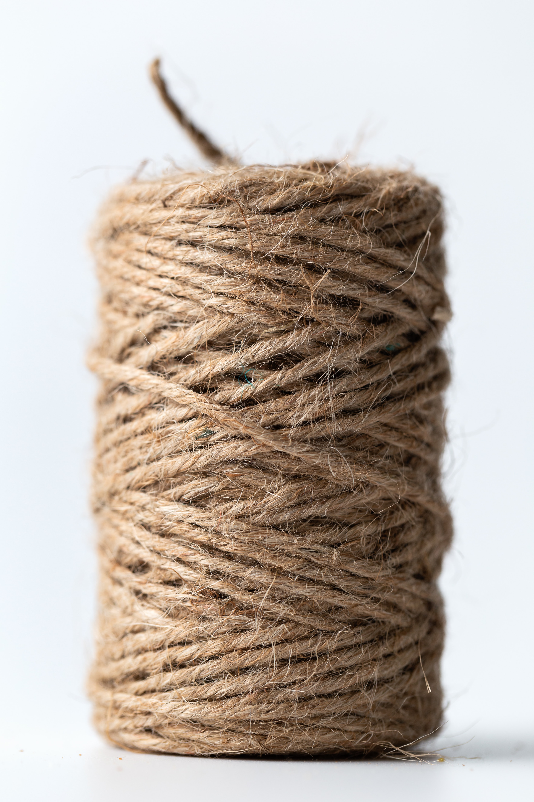

Raw strings in R
================
Vebash Naidoo
01/11/2021

<!-- Photo by <a href="https://unsplash.com/@picoftasty?utm_source=unsplash&utm_medium=referral&utm_content=creditCopyText">Mae Mu</a> on <a href="https://unsplash.com/s/photos/string?utm_source=unsplash&utm_medium=referral&utm_content=creditCopyText">Unsplash</a> -->
<figure>

<figcaption>
Picture from <em>Mae Mu</em> on Unsplash
</figcaption>
</figure>

In version `4.0.0` of R <span
style="color: #5196b4;background-color:#f4e4e7">raw strings</span> were
introduced. From the [CRAN
Page](https://cran.r-project.org/doc/manuals/r-release/NEWS.html)
<em>“There is a new syntax for specifying raw character constants
similar to the one used in C++: <span
style="color: #5196b4;background-color:#f4e4e7">r"(…)"</span> with … any
character sequence not containing the sequence )”. This makes it easier
to write strings that contain backslashes or both single and double
quotes. For more details see <span
style="color: #5196b4;background-color:#f4e4e7">?Quotes</span>."</em>

Everything inside the delimiters <span
style="color: #5196b4;background-color:#f4e4e7">`r"(`</span> and <span
style="color: #5196b4;background-color:#f4e4e7">`)"`</span> are
considered literally.

``` r
r"( Here's a string that contains "double quotes" and single quotes "Ain't that nifty" )"
```

    ## [1] " Here's a string that contains \"double quotes\" and single quotes \"Ain't that nifty\" "

Even the space I added after the opening bracket <span
style="color: #5196b4;background-color:#f4e4e7">r"( </span> and before
the closing bracket <span
style="color: #5196b4;background-color:#f4e4e7"> )"</span> are viewed
literally in the string.

### Example: Folder structures

``` r
folder <- r"(C:\Current-Work\code-snippets\raw-strings)"
folder
```

    ## [1] "C:\\Current-Work\\code-snippets\\raw-strings"

``` r
writeLines(folder)
```

    ## C:\Current-Work\code-snippets\raw-strings

### Example: Detect certain regex patterns

#### IPv4 Addresses

From
[O’Reilly](https://www.oreilly.com/library/view/regular-expressions-cookbook/9780596802837/ch07s16.html)

``` r
# Simple regex
simple_ipv4 <- r"(^(?:[0-9]{1,3}\.){3}[0-9]{1,3}$)"
stringr::str_detect("255.255.255.255", simple_ipv4)
```

    ## [1] TRUE

``` r
# Accurate regex
acc_ipv4 <- r"(^(?:(?:25[0-5]|2[0-4][0-9]|[01]?[0-9][0-9]?)\.){3}(?:25[0-5]|2[0-4][0-9]|[01]?[0-9][0-9]?)$)"

stringr::str_detect("255.255.255.255", acc_ipv4)
```

    ## [1] TRUE

``` r
stringr::str_detect("192.0.2.146", acc_ipv4)
```

    ## [1] TRUE

``` r
# What about CIDR blocks?
stringr::str_detect("10.0.0.0/8", acc_ipv4) # nope
```

    ## [1] FALSE

``` r
# If we extract the network part of the CIDR block i.e. the 10.0.0.0 part?
stringr::str_detect(
  # extract the network part i.e. the 10.0.0.0
    stringr::str_extract(
        "10.0.0.0/8",
       # pattern to extract using raw string
       r"(^(?:(?:25[0-5]|2[0-4][0-9]|[01]?[0-9][0-9]?)\.){3}(?:25[0-5]|2[0-4][0-9]|[01]?[0-9][0-9]?))"
     ),
     # can we detect an ip address in the extracted part?
     acc_ipv4
 ) # it is valid after extraction
```

    ## [1] TRUE

``` r
# Why is 224.260.9.32 an invalid IP address?
# https://en.wikipedia.org/wiki/IP_address
# An 8 bit group (octet) may not have a value higher than 255, therefore 260 is not a valid number.
stringr::str_detect("224.260.9.32", acc_ipv4)
```

    ## [1] FALSE

<br>

#### Email addresses

``` r
email_regex <- r"((^[a-zA-Z0-9_.+-]+@[a-zA-Z0-9-]+\.[a-zA-Z0-9-.]+$))"

stringr::str_detect(c("testing@gmail.com",
                      "test@graw.co.za",
                      "s@m@testdomain.ac.za",
                      "test#testing@gmail.com",
                      "legit@gmail,com"),
                    email_regex)
```

    ## [1]  TRUE  TRUE FALSE FALSE FALSE

#### str\_extract Help Page Examples

``` r
shopping_list <- c("apples x4", "bag of flour", "bag of sugar", "milk x2")

str_extract(shopping_list, "\\d") # original way - escape the digit \ by using \\d
```

    ## [1] "4" NA  NA  "2"

``` r
str_extract(shopping_list, 
            r"(\d)" # raw string way
            )
```

    ## [1] "4" NA  NA  "2"

``` r
str_extract(shopping_list, "\\b[a-z]{1,4}\\b") # original way with escape
```

    ## [1] NA     "bag"  "bag"  "milk"

``` r
str_extract(shopping_list, r"(\b[a-z]{1,4}\b)") # raw string way
```

    ## [1] NA     "bag"  "bag"  "milk"

``` r
str_extract_all(shopping_list, "\\b[a-z]+\\b") # original way with escape
```

    ## [[1]]
    ## [1] "apples"
    ## 
    ## [[2]]
    ## [1] "bag"   "of"    "flour"
    ## 
    ## [[3]]
    ## [1] "bag"   "of"    "sugar"
    ## 
    ## [[4]]
    ## [1] "milk"

``` r
str_extract_all(shopping_list, r"(\b[a-z]+\b)") # raw string way
```

    ## [[1]]
    ## [1] "apples"
    ## 
    ## [[2]]
    ## [1] "bag"   "of"    "flour"
    ## 
    ## [[3]]
    ## [1] "bag"   "of"    "sugar"
    ## 
    ## [[4]]
    ## [1] "milk"
